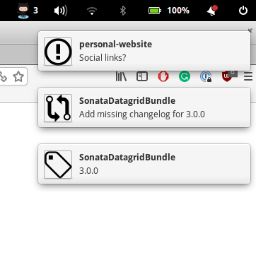

Github Notifier
===============

Rust application that will show you number of notifications in your status bar and
send you github notifications to your Linux notifications.

Port of [Python ghnotifier](https://github.com/kunicmarko20/ghnotifier).

> Note: Tested only on Ubuntu 16.04+

Requirements
============

* libappindicator installed


How to install
==============

* Download [ghnotifier](https://github.com/kunicmarko20/ghnotifier-rs/releases/latest) binary
* Run `./ghnotifier install`

Now you should have a desktop entry and in your search you will be able to find Github Notifier application.

If application is missing, just run `ghnotifier run -d`.


Screenshots
===========

Notifications:



Menu:


Settings:


Other Commands
==============
```bash
ghnotifier-rs 0.2.0
kunicmarko20 <kunicmarko20@gmail.com>

USAGE:
    ghnotifier [FLAGS] <SUBCOMMAND>

FLAGS:
    -h, --help       Prints help information
    -q, --quiet      Don't output anything to the console
    -V, --version    Prints version information

SUBCOMMANDS:
    help           Prints this message or the help of the given subcommand(s)
    install        Installs the needed things.
    run            Starts the Application
    self-update    Update application to a newer version
    uninstall      Removes everything

```
